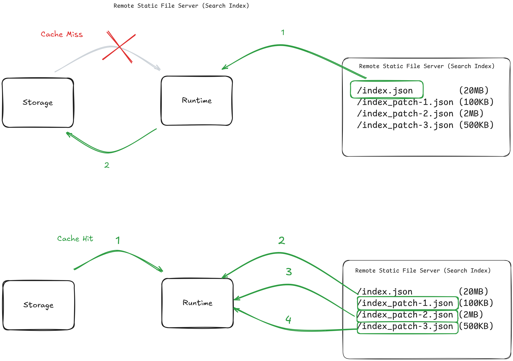

# Picosearch

(This document was **not** written by AI)

Picosearch aims to be a minimalistc, in-memory, browser-compatible, local-first search engine to be used for small to medium sized datasets. The native syncing capabilites and storage driver interface enable a variety of use cases.

## Data Components

The following types of data of a Picosearch instance can be distinguished:

- The raw **documents**.
- The **search index**, which is created by indexing the raw documents.
- Changes in documents (addition, modification, deletion) can be applied as **patches** to an existing search index.

### Document

A document is a JSON-serializable object with a unique identifier. Indexed fields must be an object key or path in dot notiation (e.g., "content.title", "orders.0.name"). There must exist a top-level string ID field.

### Search Index

A search index is a JSON-serializable object containing a RadixBKTreeMap for efficient token-lookup, fuzzy search and prefix matching, as well as other, BM25F-specific data. Details can be inspected in the implementation.

### Patch

A patch is a JSON-serializable object with a `version` number and an array `changes`. A change has a `type` key with one of the values "add", "modify", "delete", which have to be applied in order to an index that has the state after applying all patches except `version`.

## Deployment Models

Using the different data components, a variety of deployment models are possible. 

The documents can be located either inside the search index itself, as a simple, compact but large file, or lazily loaded via ID from any other location when excluded from the index. In the browser context, the local storage capabilities may be restricted in size and loading all documents via network may be inefficient or slow, whereas indexing the documents offline, then only downloading the search index and fetching individual documents during query time is much more performant, with minimal overhead.  

Patches can be used for incremental updates to a search index, containing only the changes, such that only the changes can be fetched and not the entire new index.

In the local context (e.g. browser), the search index may not only live in-memory, but can be stored on persistent storage, such that at a later time it does not need to be fetched remotely again. 

**Example:**

## Syncing

Picosearch has an opinionated syncing API that assumes remote files are being stored on simple static file servers. Local storage drivers for the browser context are included, but custom drivers can be easily written by implementing the simple interface. However, fetching patch files via other protocals than HTTP(S) is currently not supported (documents can still be fetched via any async function).

### URL Patterns

Inside a Picosearch instance, the following information for remote fetching can be stored:

- An URL pattern to fetch a document by its ID with a placeholder `{id}`
- An URL pattern to fetch a patch by its version number with a placeholder `{version}`
- An URL for fetching the entire search index

### Fetch Strategy

**With Local Storage**

In case there is a persistent storage configured, the index is first tried to load from there. If it is not found, it is fetched from the remote storage. If it is found, then Picosearch tries to fetch patches with an incremented version number until no more are found.

**Note:** The index file stored on the remote storage should always be kept up-to-date, such that it has the same version as the last available patch. Picosearch will not try to fetch update patches when the entire index is fetched.

**Without Local Storage**

This scenario is identical to the above, where everytime there is a "cache miss" without persisting anything.

## Search Algorithm

Picosearch implements a the BM25F algorithm, an extension to BM25 that enables scoring across multiple fields of a document with optional field weights. 

