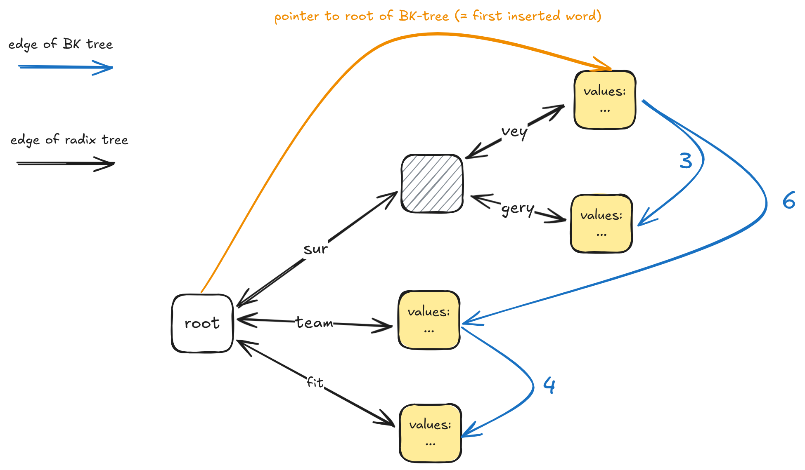

# RadixBKTreeMap

This package implements a merge of a RadixTree and a BK-Tree with the goal of having a space-efficient data structure that performs well for both prefix and fuzzy search. Its main purpose is the use in Picosearch.

The RadixTree is extended by adding edges on leaf nodes that create a BK-Tree. The root of the BK-Tree is the first inserted value.



**Advantages**

- space efficiency
- fast prefix search and fuzzy search in one data structure
- it is also possible to insert values only into the radix tree or only into the BK-Tree, i.e. some words are only searchable by prefix/exact match and some words are only searchable by fuzzy search


**Disadvantages**

- complexity
- fuzzy search (and insertion into the BK-Tree) is not as fast as a normal BK-Tree because words need to be reconstructed by climbing up the RadixTree to the root
- deleting nodes is not possible without rebuilding the BK-Tree part. Currently deletion is not supported at all

## Installation

```bash
pnpm add @picosearch/radix-bk-tree
```

## Usage

### insert

```ts
import { RadixBKTreeMap } from '@picosearch/radix-bk-tree';

const radixBKTreeMap = new RadixBKTreeMap<number>();
radixBKTreeMap.insert('abc', 1);
radixBKTreeMap.insert('abd', 2);

console.log(radixBKTreeMap.lookup('abc')); // [1]
console.log(radixBKTreeMap.lookup('ae')); // null
```

If no value is provided, the key will only be searchable by `getFuzzyMatches`. If you only want to search for prefix matches, you can use `insertNoFuzzy`.

### getPrefixMatches

```ts
radixBKTreeMap.getPrefixMatches('ab'); // ['abc', 'abd']
```

### getFuzzyMatches

```ts
radixBKTreeMap.getFuzzyMatches('ab', { maxError: 1 }); // ['abc', 'abd']
```

### toJSON + fromJSON

```ts
import { RadixBKTreeMap } from '@picosearch/radix-bk-tree';

const radixBKTreeMap = new RadixBKTreeMap<number>();
radixBKTreeMap.insert('abc', 1);
radixBKTreeMap.insert('abd', 2);

const jsonStr = radixBKTreeMap.toJSON();
const newRadixBKTreeMap = RadixBKTreeMap.fromJSON(jsonStr);

console.log(newRadixBKTreeMap.lookup('abc')); // [1]
console.log(newRadixBKTreeMap.lookup('ae')); // null
```

